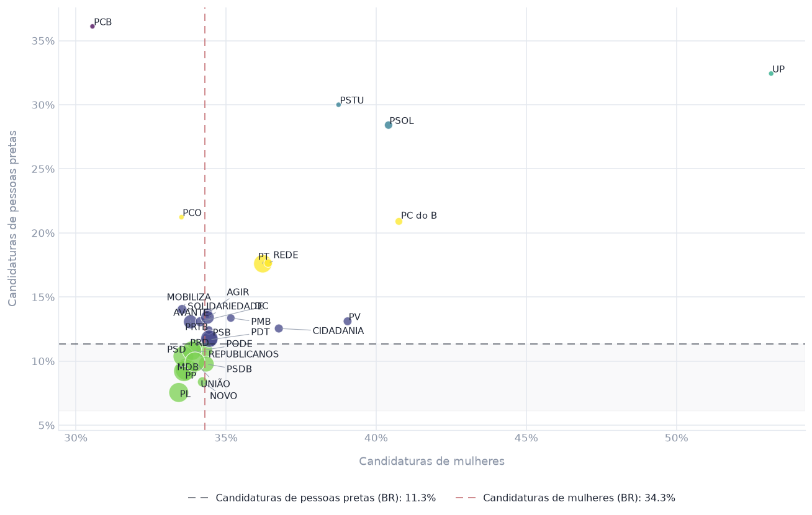

# Análise de dados TSE

Perfil de gênero e cor/raça das candidaturas às eleições municipais de 2024, por
partido, a partir dos dados abertos do TSE.

**[Aplicativo publicado](https://SEU-APP.streamlit.app)**



Cada ponto é um partido. As linhas marcam a taxa do recorte selecionado. Dá para
filtrar por UF e por cargo, trocar as métricas dos eixos, dimensionar os pontos
por volume de candidaturas e agrupar os partidos por similaridade.

> O pipeline roda em SQLite e a migração para Databricks está em andamento.

## Dados

| | |
|---|---|
| Fonte | [Dados abertos do TSE](https://dadosabertos.tse.jus.br/dataset/candidatos-2024) |
| Volume | 463.845 candidaturas, 26 UFs, 3 cargos |
| Saída | 2.695 linhas: partido × UF × cargo, com agregados nacionais |

Do recorte nacional: 34,3% das candidaturas são de mulheres e 11,3% de pessoas
pretas. A variação entre partidos é bem maior em cor/raça (coeficiente de variação
de 49,1%) do que em gênero (11,4%), o que era esperado, já que há cota legal para gênero,
não para cor/raça.


## Rodando

```bash
pip install -r requirements.txt
```

Baixe os pacotes de candidatos e de bens de candidatos de 2024 no
[portal do TSE](https://dadosabertos.tse.jus.br/dataset/candidatos-2024) e extraia
em `data/`, com os nomes de pasta que estão em `src/ingestoes.json`. Depois:

```bash
cd src && python ingestao.py
cd data_prepare && python main.py
streamlit run ../app/app.py
```

## Estrutura

```
src/
├── ingestao.py
├── ingestoes.json
├── analise.py
├── partidos.sql
├── data_prepare/
│   ├── etl_partidos.sql
│   └── main.py
└── app/
    ├── app.py
    └── utils.py
```
